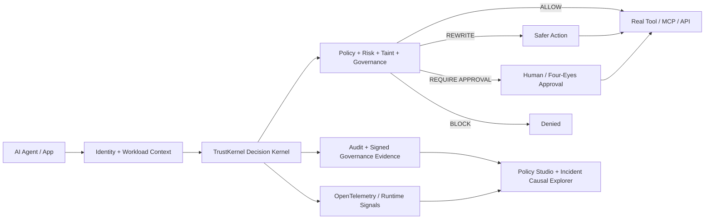
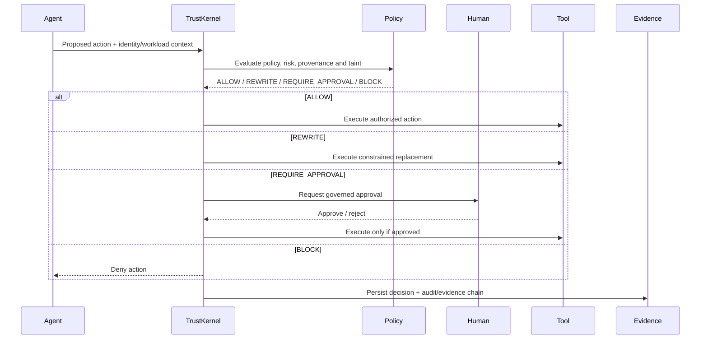

# TrustKernel — Judge Architecture Map

Use this page while explaining the system. It is intentionally compact enough to keep open beside the live demo.

## One-sentence architecture

TrustKernel is a policy and evidence layer between an AI agent and real tools: it verifies identity and workload context, evaluates each proposed action, rewrites or escalates risky actions, records tamper-evident evidence, and exposes the decision path to operators.

## Runtime decision path

## What is real in the prototype

| Layer | Implemented checkpoint |
| --- | --- |
| Identity | OIDC discovery, exact issuer validation, audience validation, bounded clock skew, key-rotation refresh and configurable claims |
| Workload trust | Provider-neutral workload attestation metadata plus external KMS/HSM/SPIFFE-style signer adapter contract |
| Policy/runtime | Deterministic decision kernel with ALLOW, REWRITE, REQUIRE_APPROVAL and BLOCK paths |
| Governance | Policy/MCP change evidence, four-eyes workflow, signed evidence envelopes |
| Persistence | SQLite offline mode plus PostgreSQL persistence abstraction and migrations |
| Distributed controls | Provider-neutral quota backend interface |
| Observability | Existing deterministic OTLP path plus optional native OpenTelemetry SDK exporter |
| Operator UX | Policy Studio diff/approval flow and Incident Causal Explorer/remediation timeline |
| Evaluation | Bundled deterministic regression benchmark plus stronger dataset import/provenance reporting |
| Delivery | Packageable Python SDK, production deployment checks, CI, Judge Mode and guarded demo recovery |

## 90-second judge route

**0–15 s — Problem.** Agents are increasingly allowed to call databases, APIs, code runners, payment tools and other agents. Authentication alone does not decide whether a specific action is safe to execute.

**15–35 s — Core.** Show Judge Mode. Point out that TrustKernel sits before the tool call and can allow, rewrite, require human approval or block.

**35–55 s — Governance.** Open Policy Studio. Show a policy diff and the four-eyes approval path, then explain that the change produces portable signed governance evidence.

**55–75 s — Incident explainability.** Open Incident Causal Explorer. Walk from risky action to finding, remediation and linked audit evidence.

**75–90 s — Production path.** Mention PostgreSQL, OIDC, workload attestation, distributed quotas, OpenTelemetry and the production readiness gate. Close by stating that the offline SQLite/Judge Mode path exists so the core product remains demonstrable without internet access.

## Judge questions: shortest useful answers

**Is this just another prompt filter?** No. TrustKernel evaluates proposed actions and execution context at the tool boundary; it also governs approvals, workload identity, evidence and runtime policy.

**What happens when the model is wrong?** The model is not the enforcement authority in the deterministic prototype path. Policy and runtime checks decide whether an action is allowed, rewritten, escalated or blocked.

**Can it work with enterprise identity?** The production path supports standards-based OIDC discovery and configurable claim mapping; the architecture also exposes workload-attestation and external signer adapters.

**What if the internet fails during the hackathon?** The default demo uses SQLite and local/demo identity so Judge Mode, the command center, audit chain and bundled regression evidence remain available offline.

**Are your benchmark percentages real-world security accuracy?** No. Bundled and imported benchmark outputs are regression/evaluation evidence only. They are not production security accuracy, certification, or a guarantee against real-world attacks.

## Demo safety rule

Run `cd backend && python rehearsal.py` before opening the live demo. If it is not green, recover first; do not improvise around a failed integrity gate in front of the judges.
